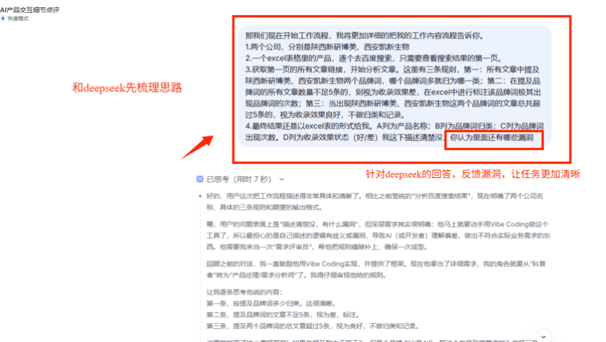
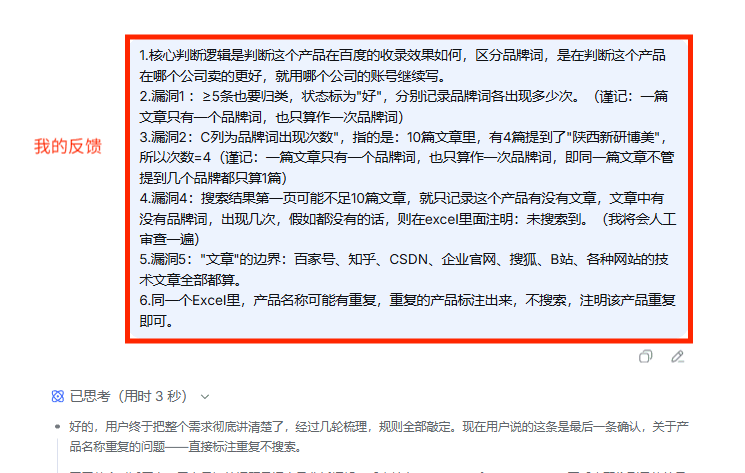
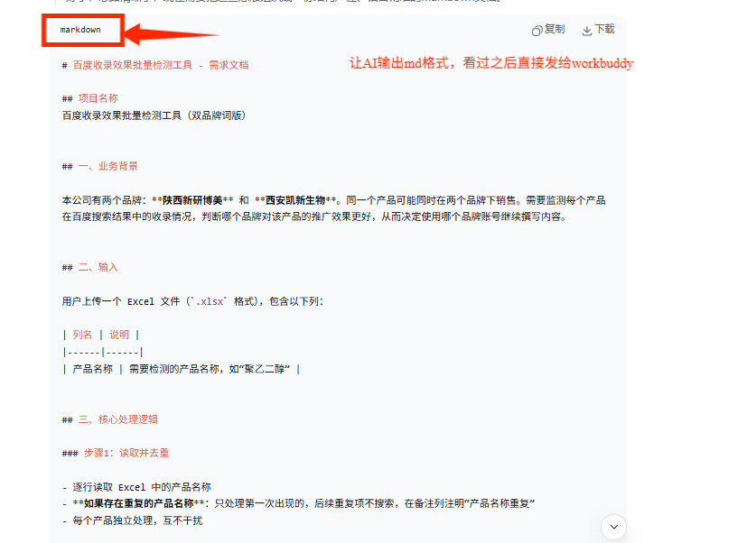
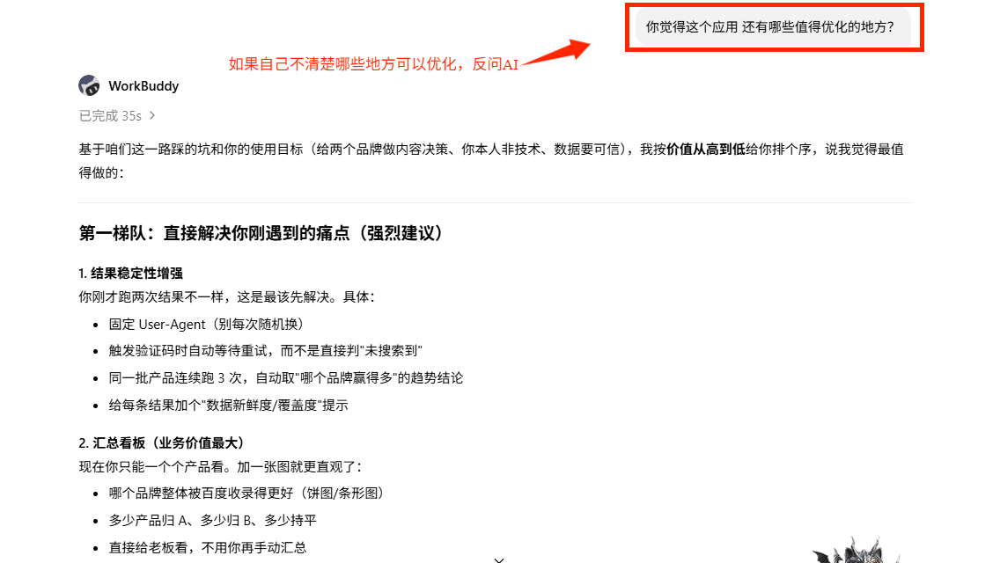
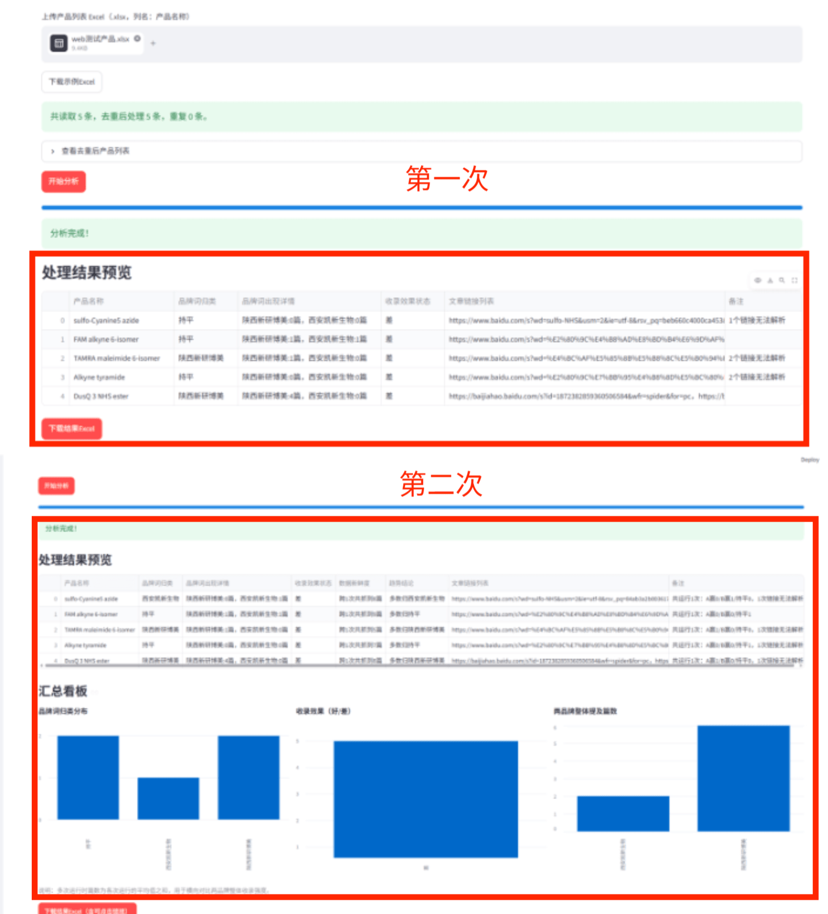
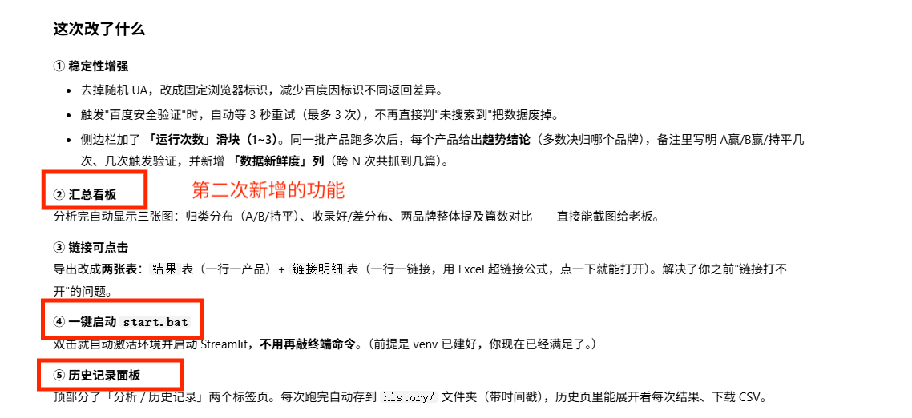

# 百度收录效果批量检测工具（双品牌词版）

一个给市场 / 内容运营同学用的小工具：上传一张产品清单 Excel，它帮你**自动在百度搜索每个产品**，判断文章里有没有提到你们两个品牌，最后输出一份带「归类 + 收录效果 + 链接」的 Excel 报告。

> 适合场景：同一款产品可能在「陕西新研博美」和「西安凯新生物」两个品牌下同时销售，市场部要决定用哪个品牌账号继续写内容 —— 这个工具帮你用数据说话。

---

## 它能做什么

- **批量检测**：一次上传几十个产品，自动逐个去百度第一页搜索、逐篇打开文章。
- **双品牌对比**：自动统计「陕西新研博美」「西安凯新生物」各被多少篇文章提到，谁多就归到谁。
- **指定品牌模式**：上传时在「品牌」列填好归属，工具就只判断该品牌的收录效果（详见下方输入格式）。
- **多名称 / CAS 号拆分搜索**：产品名里写 `聚乙二醇/PEG` 或 `聚乙二醇 1159408-67-9`，会自动拆成多个词分别搜索再合并结果，覆盖更全。
- **稳定性增强**：固定浏览器标识、触发验证码自动重试、可设多次运行取趋势，结果更可信。
- **汇总看板**：跑完直接出图，一眼看清两个品牌整体收录谁更好。
- **结果可点击**：导出的 Excel 带「链接明细」表，每行一个链接，点一下就能打开。
- **历史记录**：每次分析自动存档，随时回看、对比不同时间的效果变化。
- **一键启动**：双击 `start.bat` 即可打开网页，不用敲命令。

---

## 技术栈

| 组件 | 选型 |
|------|------|
| 界面 | Python + Streamlit |
| 浏览器自动化 | Playwright（模拟真实浏览器，规避百度反爬） |
| 品牌词判断 | 本地精确匹配（离线，默认）/ 大模型 API（可选） |
| Excel 处理 | pandas + openpyxl |

---

## 目录结构

```
baidu_index_checker/
├── app.py                      # 主程序（全部功能都在这里）
├── requirements.txt            # 依赖清单
├── run.bat                    # 首次安装依赖 + 启动（纯ASCII）
├── start.bat                  # 一键启动（已装好依赖后双击即用）
├── make_sample.py             # 生成示例 Excel
├── sample_products.xlsx       # 示例产品清单（无品牌列）
├── _selftest.py               # 核心逻辑自测（37 项）
├── screenshots/               # README 配图
├── 百度收录检测工具_STAR.md    # 求职作品集文案（STAR 法则）
└── 百度收录检测工具_STAR.docx  # 同上，Word 版
```

---

## 使用方法（本地运行）

> 需要联网。首次运行会下载依赖和浏览器内核（几分钟）。

**方式一：双击启动（推荐，已装好依赖后）**
1. 双击 `start.bat`，浏览器自动打开 `http://localhost:8501`。

**方式二：命令行**
```bash
cd baidu_index_checker
python -m venv venv
venv\Scripts\activate.bat
python -m pip install -r requirements.txt
python -m playwright install chromium
python -m streamlit run app.py
```

打开网页后：
1. 点「浏览」上传产品 Excel（或先点「下载示例Excel」拿模板）；
2. 点蓝色「开始分析」，进度条走完；
3. 点「下载结果Excel」保存报告。

> 系统若提示缺少 VC++ 运行库，去 https://aka.ms/vs/17/release/vc_redist.x64.exe 装一下即可。

---

## 输入格式

### 模式 A：指定品牌（有「品牌」列）
| 品牌 | 产品名称 |
|------|----------|
| 陕西新研博美 | 聚乙二醇 |
| 西安凯新生物 | DSPE-PEG |
| 陕西新研博美 | 1159408-67-9 |

→ 归类直接取你填的品牌，只判断该品牌收录效果（好 / 差）。

### 模式 B：自动判断（只有产品名）
| 产品名称 |
|----------|
| 聚乙二醇 |
| DSPE-PEG |
| 巯基聚乙二醇 / mPEG-SH |

→ 工具自动比较两品牌谁被提及得多，多者归类；持平标「持平」。

---

## 输出说明（6 列 Excel）

| 列 | 含义 |
|----|------|
| 产品名称 | 原数据 |
| 品牌词归类 | 归到哪个品牌 / 持平 |
| 品牌词出现详情 | 各品牌被提及篇数，如 `陕西新研博美:3篇，西安凯新生物:4篇` |
| 收录效果状态 | 总提及 ≥5 篇标「好」，否则「差」 |
| 数据新鲜度 | 本次跨多次运行共抓到多少篇文章 |
| 趋势结论 | 多次运行下多数归哪个品牌 |
| 文章链接列表 | 第一页所有可解析链接（逗号分隔） |
| 备注 | 异常说明（未搜索到 / 链接无法解析 / 拆分检索词 / CAS号检索 等） |

---

## 截图

**需求梳理（借 AI 把需求想清楚）**



**第一轮核心功能**



**需求文档**



**基于真实反馈迭代（反问 AI 还能优化什么）**



**第一次 vs 第二次效果对比**



**第二轮新增功能清单**



---

## 作为求职作品

本项目整理了 STAR 法则版文案，见 [`百度收录检测工具_STAR.md`](百度收录检测工具_STAR.md)（附 Word 版 `百度收录检测工具_STAR.docx`）。

---

## 注意事项

- 百度对自动化浏览器可能偶尔弹验证码，工具会重试；仍失败时备注「触发百度安全验证」，隔会儿再跑即可。
- 搜索结果实时变化，单次数据当作「风向标」，多次运行看趋势更稳。
- 本项目仅用于合法的产品收录情况统计，请遵守各平台 robots 与合理使用规范。

---

## License

MIT
